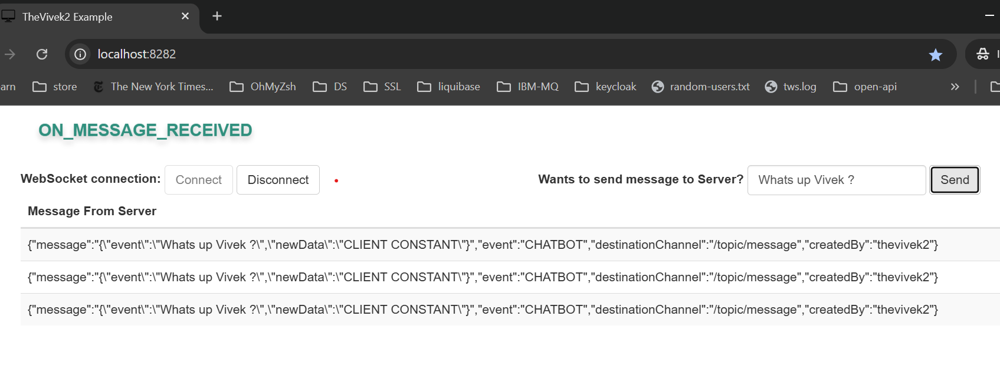

# TheVivek2 Example (Questioning what is best ON )

~~~
-> Kotlin Coroutines
-> Rest API
-> Request Param to Query Search
-> WebSockets (Multicast & User, UserGroups restrictions)
-> Authorization Config
-> Database migration using Fluyway
-> Spring Contract Verifier
~~~ 

## Getting started
~~~
java 17.0.11
maven 3.6.3
mvn clean install
mvn clean install -DskipTests=true

Go to target and run this command  !!>>
java -jar example-v1-0.0.1-SNAPSHOT.jar --spring.profiles.active=INIT_CLIENT_DATA

http://localhost:8282/swagger-ui/index.html  -- Swagger UI 
http://localhost:8282 -- UI connected via WebSocket

~~~
## Few Screens 

### Refresh SCOPE... :
POST http://localhost:8282/actuator/env
{ "name":thevivek2.testing.refreshable.beans.use, "value":"STATIC"}
POST http://localhost:8282/actuator/refresh

